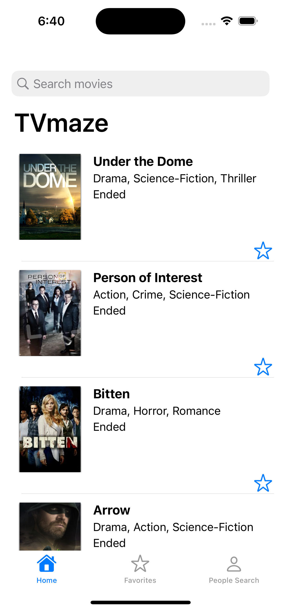
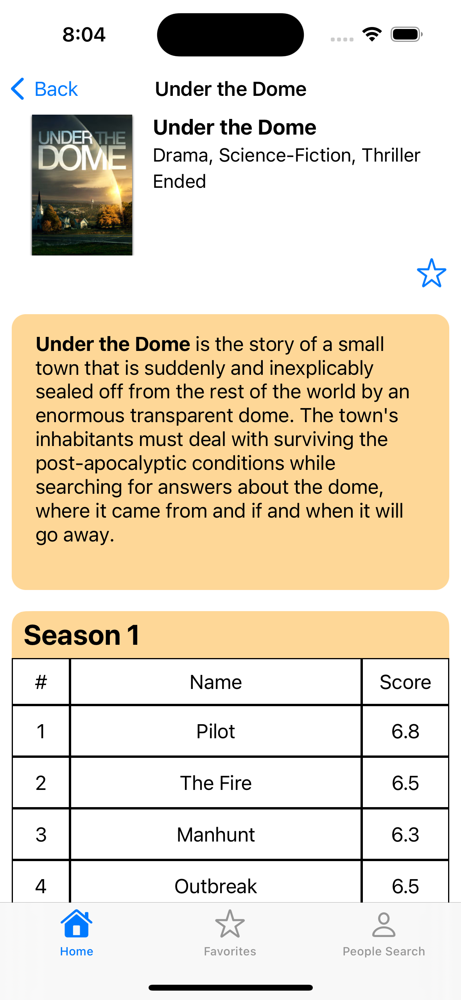
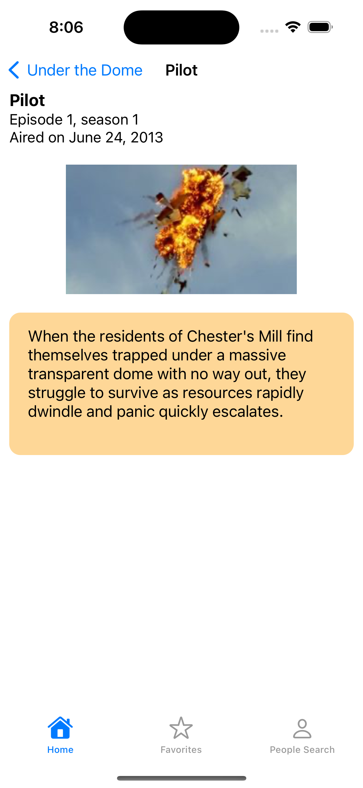
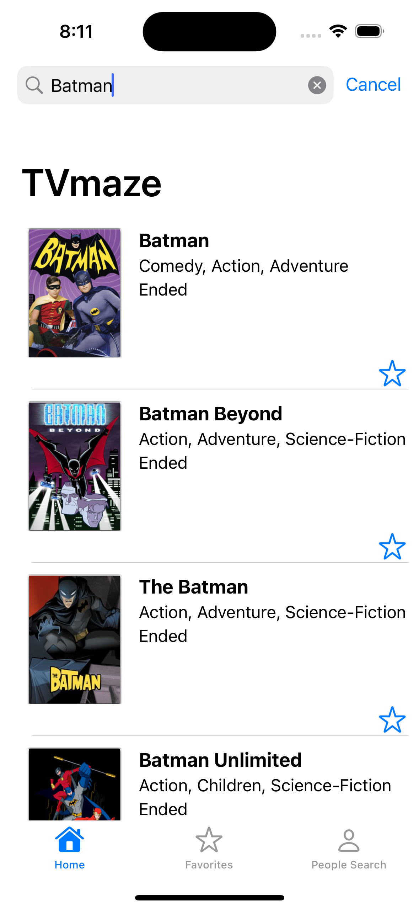

Some core screens:

<p align = "center">
 
 
</p>

## Table of contents
* [General info](#general-info)
* [Technologies](#technologies)
* [Setup](#setup)

## General info
This project is a TVmaze series catalog browser with the capabilities to:
- Browse over a main home page of series
- Filter series search based on name of the series
- Browse over each series seasons and episodes detail
- Add series to your own list of favorites
- Setup an initial PIN security factor to a simple login
- Filter people that has worked on series based on the person's name
	
## Technologies
Project is created with:
* VIPER design pattern
* CocoaPods dependency manager
* KeychainAccess framework
* Alamofire framework
* Codeable protocol
* TVmaze own free public REST API (https://www.tvmaze.com/api)
	
## Setup
To run this project, install the required frameworks using CocoaPods:

```
$ cd ../TVmaze
$ pod install
```
